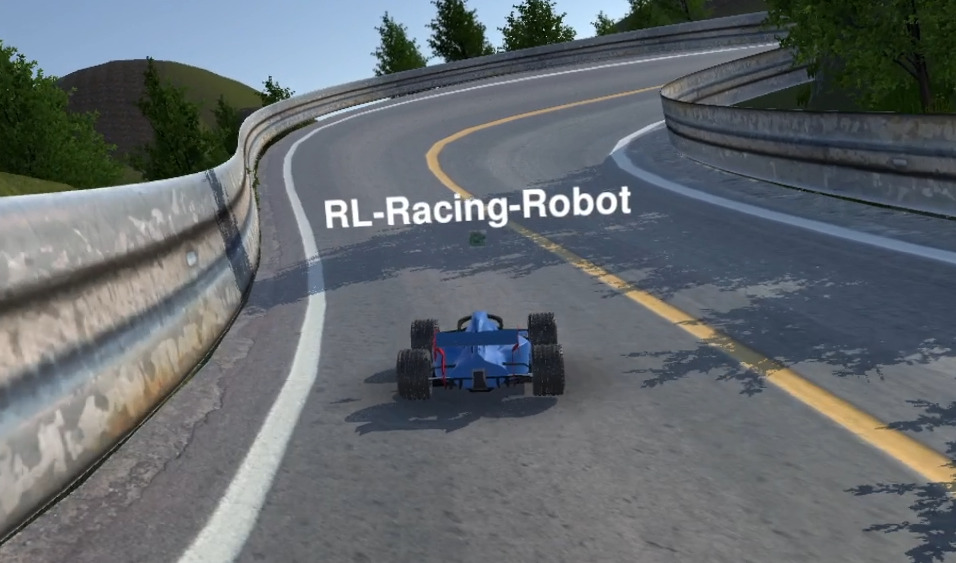

<!-- [](https://gitlab.com/araffin/rl-baselines3-zoo/-/commits/master) -->

[](https://rl-baselines3-zoo.readthedocs.io/en/master/?badge=master)
[](https://gitlab.com/araffin/rl-baselines3-zoo/-/commits/master) [](https://github.com/psf/black)


# RL Baselines3 Zoo: A Training Framework for Stable Baselines3 Reinforcement Learning Agents



RL Baselines3 Zoo is a training framework for Reinforcement Learning (RL), using [Stable Baselines3](https://github.com/DLR-RM/stable-baselines3).

It provides scripts for training, evaluating agents, tuning hyperparameters, plotting results and recording videos.

In addition, it includes a collection of tuned hyperparameters for common environments and RL algorithms, and agents trained with those settings.


We are **looking for contributors** to complete the collection!

Goals of this repository:

1. Provide a simple interface to train and enjoy RL agents
2. Benchmark the different Reinforcement Learning algorithms
3. Provide tuned hyperparameters for each environment and RL algorithm
4. Have fun with the trained agents!

This is the SB3 version of the original SB2 [rl-zoo](https://github.com/araffin/rl-baselines-zoo).

## Documentation

Documentation is available online: [https://rl-baselines3-zoo.readthedocs.io/](https://rl-baselines3-zoo.readthedocs.io)

## Installation

### Minimal installation

From source:
```
pip install -e .
```

As a python package:
```
pip install rl_zoo3
```

Note: you can do `python -m rl_zoo3.train` from any folder and you have access to `rl_zoo3` command line interface, for instance, `rl_zoo3 train` is equivalent to `python train.py`

### Full installation (with extra envs and test dependencies)

```
apt-get install swig cmake ffmpeg
pip install -r requirements.txt
```

Please see [Stable Baselines3 documentation](https://stable-baselines3.readthedocs.io/en/master/) for alternatives to install stable baselines3.

## Train an Agent

The hyperparameters for each environment are defined in `hyperparameters/algo_name.yml`.

If the environment exists in this file, then you can train an agent using:
```
python train.py --algo algo_name --env env_id
```

Evaluate the agent every 10000 steps using 10 episodes for evaluation (using only one evaluation env):
```
python train.py --algo sac --env HalfCheetahBulletEnv-v0 --eval-freq 10000 --eval-episodes 10 --n-eval-envs 1
```

More examples are available in the [documentation](https://rl-baselines3-zoo.readthedocs.io).


## Integrations

The RL Zoo has some integration with other libraries/services like Weights & Biases for experiment tracking or Hugging Face for storing/sharing trained models. You can find out more in the [dedicated section](https://rl-baselines3-zoo.readthedocs.io/en/master/guide/integrations.html) of the documentation.

## Plot Scripts

Please see the [dedicated section](https://rl-baselines3-zoo.readthedocs.io/en/master/guide/plot.html) of the documentation.

## Enjoy a Trained Agent

**Note: to download the repo with the trained agents, you must use `git clone --recursive https://github.com/DLR-RM/rl-baselines3-zoo`** in order to clone the submodule too.


If the trained agent exists, then you can see it in action using:
```
python enjoy.py --algo algo_name --env env_id
```

For example, enjoy A2C on Breakout during 5000 timesteps:
```
python enjoy.py --algo a2c --env BreakoutNoFrameskip-v4 --folder rl-trained-agents/ -n 5000
```

## Hyperparameters Tuning

Please see the [dedicated section](https://rl-baselines3-zoo.readthedocs.io/en/master/guide/tuning.html) of the documentation.

## Custom Configuration

Please see the [dedicated section](https://rl-baselines3-zoo.readthedocs.io/en/master/guide/config.html) of the documentation.

## Current Collection: 200+ Trained Agents!

Final performance of the trained agents can be found in [`benchmark.md`](./benchmark.md). To compute them, simply run `python -m rl_zoo3.benchmark`.

List and videos of trained agents can be found on our Huggingface page: https://huggingface.co/sb3

*NOTE: this is not a quantitative benchmark as it corresponds to only one run (cf [issue #38](https://github.com/araffin/rl-baselines-zoo/issues/38)). This benchmark is meant to check algorithm (maximal) performance, find potential bugs and also allow users to have access to pretrained agents.*

### Atari Games

7 atari games from OpenAI benchmark (NoFrameskip-v4 versions).

|  RL Algo |  BeamRider         | Breakout           | Enduro             |  Pong | Qbert | Seaquest           | SpaceInvaders      |
|----------|--------------------|--------------------|--------------------|-------|-------|--------------------|--------------------|
| A2C      | :heavy_check_mark: | :heavy_check_mark: | :heavy_check_mark: | :heavy_check_mark: | :heavy_check_mark: | :heavy_check_mark: | :heavy_check_mark: |
| PPO      | :heavy_check_mark: | :heavy_check_mark: | :heavy_check_mark: | :heavy_check_mark: | :heavy_check_mark: | :heavy_check_mark: | :heavy_check_mark: |
| DQN      | :heavy_check_mark: | :heavy_check_mark: | :heavy_check_mark: | :heavy_check_mark: | :heavy_check_mark: | :heavy_check_mark: | :heavy_check_mark: |
| QR-DQN   | :heavy_check_mark: | :heavy_check_mark: | :heavy_check_mark: | :heavy_check_mark: | :heavy_check_mark: | :heavy_check_mark: | :heavy_check_mark: |

Additional Atari Games (to be completed):

|  RL Algo |  MsPacman   | Asteroids | RoadRunner |
|----------|-------------|-----------|------------|
| A2C      | :heavy_check_mark: | :heavy_check_mark: | :heavy_check_mark: |
| PPO      | :heavy_check_mark: | :heavy_check_mark: | :heavy_check_mark: |
| DQN      | :heavy_check_mark: | :heavy_check_mark: | :heavy_check_mark: |
| QR-DQN   | :heavy_check_mark: | :heavy_check_mark: | :heavy_check_mark: |


### Classic Control Environments

|  RL Algo |  CartPole-v1 | MountainCar-v0 | Acrobot-v1 | Pendulum-v1 | MountainCarContinuous-v0 |
|----------|--------------|----------------|------------|--------------------|--------------------------|
| ARS      | :heavy_check_mark: | :heavy_check_mark:  | :heavy_check_mark: | :heavy_check_mark: | :heavy_check_mark: |
| A2C      | :heavy_check_mark: | :heavy_check_mark:  | :heavy_check_mark: | :heavy_check_mark: | :heavy_check_mark: |
| PPO      | :heavy_check_mark: | :heavy_check_mark:  | :heavy_check_mark: | :heavy_check_mark: | :heavy_check_mark: |
| DQN      | :heavy_check_mark: | :heavy_check_mark: | :heavy_check_mark: | N/A                | N/A |
| QR-DQN   | :heavy_check_mark: | :heavy_check_mark: | :heavy_check_mark: | N/A                | N/A |
| DDPG     |  N/A |  N/A  | N/A | :heavy_check_mark: | :heavy_check_mark: |
| SAC      |  N/A |  N/A  | N/A | :heavy_check_mark: | :heavy_check_mark: |
| TD3      |  N/A |  N/A  | N/A | :heavy_check_mark: | :heavy_check_mark: |
| TQC      |  N/A |  N/A  | N/A | :heavy_check_mark: | :heavy_check_mark: |
| TRPO     | :heavy_check_mark:  | :heavy_check_mark: | :heavy_check_mark: | :heavy_check_mark: | :heavy_check_mark: |


### Box2D Environments

|  RL Algo |  BipedalWalker-v3 | LunarLander-v2 | LunarLanderContinuous-v2 |  BipedalWalkerHardcore-v3 | CarRacing-v0 |
|----------|--------------|----------------|------------|--------------|--------------------------|
| ARS      |  | :heavy_check_mark: | | :heavy_check_mark: | |
| A2C      | :heavy_check_mark: | :heavy_check_mark: | :heavy_check_mark: | :heavy_check_mark: | |
| PPO      | :heavy_check_mark: | :heavy_check_mark: | :heavy_check_mark: | :heavy_check_mark: | |
| DQN      | N/A | :heavy_check_mark: | N/A | N/A | N/A |
| QR-DQN   | N/A | :heavy_check_mark: | N/A | N/A | N/A |
| DDPG     | :heavy_check_mark: | N/A | :heavy_check_mark: | | |
| SAC      | :heavy_check_mark: | N/A | :heavy_check_mark: | :heavy_check_mark: | |
| TD3      | :heavy_check_mark: | N/A | :heavy_check_mark: | :heavy_check_mark: | |
| TQC      | :heavy_check_mark: | N/A | :heavy_check_mark: | :heavy_check_mark: | |
| TRPO     | | :heavy_check_mark: | :heavy_check_mark: | | |

### PyBullet Environments

See https://github.com/bulletphysics/bullet3/tree/master/examples/pybullet/gym/pybullet_envs.
Similar to [MuJoCo Envs](https://gym.openai.com/envs/#mujoco) but with a ~free~ (MuJoCo 2.1.0+ is now free!) easy to install simulator: pybullet. We are using `BulletEnv-v0` version.

Note: those environments are derived from [Roboschool](https://github.com/openai/roboschool) and are harder than the Mujoco version (see [Pybullet issue](https://github.com/bulletphysics/bullet3/issues/1718#issuecomment-393198883))

|  RL Algo |  Walker2D | HalfCheetah | Ant | Reacher |  Hopper | Humanoid |
|----------|-----------|-------------|-----|---------|---------|----------|
| ARS      |  |  |  |  |  | |
| A2C      | :heavy_check_mark: | :heavy_check_mark: | :heavy_check_mark: | :heavy_check_mark: | :heavy_check_mark: | |
| PPO      | :heavy_check_mark: | :heavy_check_mark: | :heavy_check_mark: | :heavy_check_mark: | :heavy_check_mark: | |
| DDPG     | :heavy_check_mark: | :heavy_check_mark: | :heavy_check_mark: | :heavy_check_mark: | :heavy_check_mark: | |
| SAC      | :heavy_check_mark: | :heavy_check_mark: | :heavy_check_mark: | :heavy_check_mark: | :heavy_check_mark: | |
| TD3      | :heavy_check_mark: | :heavy_check_mark: | :heavy_check_mark: | :heavy_check_mark: | :heavy_check_mark: | |
| TQC      | :heavy_check_mark: | :heavy_check_mark: | :heavy_check_mark: | :heavy_check_mark: | :heavy_check_mark: | |
| TRPO     | :heavy_check_mark: | :heavy_check_mark: | :heavy_check_mark: | :heavy_check_mark: | :heavy_check_mark: | |

PyBullet Envs (Continued)

|  RL Algo |  Minitaur | MinitaurDuck | InvertedDoublePendulum | InvertedPendulumSwingup |
|----------|-----------|-------------|-----|---------|
| A2C      | | | | |
| PPO      | | | | |
| DDPG     | | | | |
| SAC      | | | | |
| TD3      | | | | |
| TQC      | | | | |

### MuJoCo Environments

|  RL Algo |  Walker2d | HalfCheetah | Ant | Swimmer |  Hopper | Humanoid |
|----------|-----------|-------------|-----|---------|---------|----------|
| ARS      | :heavy_check_mark: | :heavy_check_mark: | :heavy_check_mark:  | :heavy_check_mark: | :heavy_check_mark: |  |
| A2C      | :heavy_check_mark: | :heavy_check_mark: | :heavy_check_mark: | :heavy_check_mark: | :heavy_check_mark: | :heavy_check_mark: |
| PPO      | :heavy_check_mark: | :heavy_check_mark: | :heavy_check_mark: | :heavy_check_mark: | :heavy_check_mark: | |
| DDPG     |  |  |  |  |  | |
| SAC      | :heavy_check_mark: | :heavy_check_mark: | :heavy_check_mark: | :heavy_check_mark: | :heavy_check_mark: | :heavy_check_mark: |
| TD3      | :heavy_check_mark: | :heavy_check_mark: | :heavy_check_mark: | :heavy_check_mark: | :heavy_check_mark: | :heavy_check_mark: |
| TQC      | :heavy_check_mark: | :heavy_check_mark: | :heavy_check_mark: | :heavy_check_mark: | :heavy_check_mark: | :heavy_check_mark: |
| TRPO      | :heavy_check_mark: | :heavy_check_mark: | :heavy_check_mark: | :heavy_check_mark: | :heavy_check_mark: |  |

### Robotics Environments

See https://gym.openai.com/envs/#robotics and https://github.com/DLR-RM/rl-baselines3-zoo/pull/71

MuJoCo version: 1.50.1.0
Gym version: 0.18.0

We used the v1 environments.

|  RL Algo |  FetchReach | FetchPickAndPlace | FetchPush | FetchSlide |
|----------|-------------|-------------------|-----------|------------|
| HER+TQC  | :heavy_check_mark: | :heavy_check_mark: | :heavy_check_mark: | :heavy_check_mark: |


### Panda robot Environments

See https://github.com/qgallouedec/panda-gym/.

Similar to [MuJoCo Robotics Envs](https://gym.openai.com/envs/#robotics) but with a ~free~ easy to install simulator: pybullet.

We used the v1 environments.

|  RL Algo |  PandaReach | PandaPickAndPlace | PandaPush | PandaSlide | PandaStack |
|----------|-------------|-------------------|-----------|------------|------------|
| HER+TQC | :heavy_check_mark: | :heavy_check_mark: | :heavy_check_mark: | :heavy_check_mark: | :heavy_check_mark: |


### MiniGrid Envs

See https://github.com/Farama-Foundation/Minigrid.
A simple, lightweight and fast Gym environments implementation of the famous gridworld.

| RL Algo | Empty-Random-5x5   | FourRooms          | DoorKey-5x5        | MultiRoom-N4-S5    | Fetch-5x5-N2       | GoToDoor-5x5       | PutNear-6x6-N2     | RedBlueDoors-6x6   | LockedRoom         | KeyCorridorS3R1    | Unlock             | ObstructedMaze-2Dlh |
| ------- | ------------------ | ------------------ | ------------------ | ------------------ | ------------------ | ------------------ | ------------------ | ------------------ | ------------------ | ------------------ | ------------------ | ------------------- |
| A2C     |                    |                    |                    |                    |                    |                    |                    |                    |                    |                    |                    |                     |
| PPO     | :heavy_check_mark: | :heavy_check_mark: | :heavy_check_mark: | :heavy_check_mark: | :heavy_check_mark: | :heavy_check_mark: | :heavy_check_mark: | :heavy_check_mark: | :heavy_check_mark: | :heavy_check_mark: | :heavy_check_mark: | :heavy_check_mark:  |
| DQN     |                    |                    |                    |                    |                    |                    |                    |                    |                    |                    |                    |                     |
| QR-DQN  |                    |                    |                    |                    |                    |                    |                    |                    |                    |                    |                    |                     |
| TRPO    |                    |                    |                    |                    |                    |                    |                    |                    |                    |                    |                    |                     |

There are 22 environment groups (variations for each) in total.


## Colab Notebook: Try it Online!

You can train agents online using [Colab notebook](https://colab.research.google.com/github/Stable-Baselines-Team/rl-colab-notebooks/blob/sb3/rl-baselines-zoo.ipynb).

### Passing arguments in an interactive session

The zoo is not meant to be executed from an interactive session (e.g: Jupyter Notebooks, IPython), however, it can be done by modifying `sys.argv` and adding the desired arguments.

*Example*
```python
import sys
from rl_zoo3.train import train

sys.argv = ["python", "--algo", "ppo", "--env", "MountainCar-v0"]

train()
```


## Tests

To run tests, first install pytest, then:
```
make pytest
```

Same for type checking with pytype:
```
make type
```


## Citing the Project

To cite this repository in publications:

```bibtex
@misc{rl-zoo3,
  author = {Raffin, Antonin},
  title = {RL Baselines3 Zoo},
  year = {2020},
  publisher = {GitHub},
  journal = {GitHub repository},
  howpublished = {\url{https://github.com/DLR-RM/rl-baselines3-zoo}},
}
```

## Contributing

If you trained an agent that is not present in the RL Zoo, please submit a Pull Request (containing the hyperparameters and the score too).

## Contributors

We would like to thank our contributors: [@iandanforth](https://github.com/iandanforth), [@tatsubori](https://github.com/tatsubori) [@Shade5](https://github.com/Shade5) [@mcres](https://github.com/mcres), [@ernestum](https://github.com/ernestum), [@qgallouedec](https://github.com/qgallouedec)
